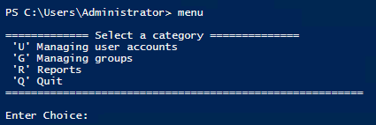
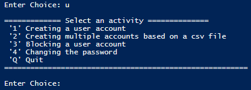

# PS-Mgmt
PowerShell script that automates operation in Active Directory, related to user accounts, groups and generating reports.

All generated files and reports will be located in "c:\Program Files\"

After starting the script, the user will be asked for the name of the name of the OU in which the created accounts and groups are to be located.
OU is located in the domain in use by default.

If OU is not in the domain it will be created.

After that all actions are managed by function "menu", which user should invoke.

Main menu

One of sub menus

Overall all script allows for:

Creating a user account

Creating multiple accounts based on a csv file

Blocking a user account

Changing the password

Creating new groups

Adding users to groups

Generating Lists of: groups with their members, blocked accounts, detailed information about user accounts, detailed information about computers in the domain or organizational units in the domain. 
